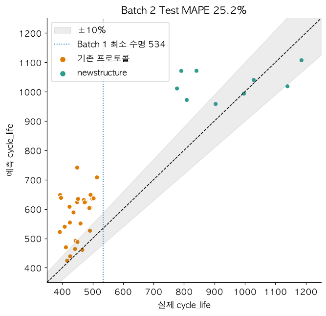
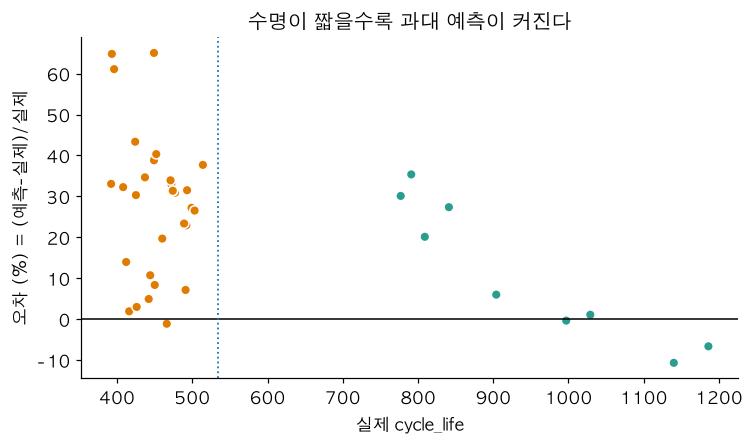

# ESS 배터리 수명 예측

> 초기 100 사이클 데이터만으로 리튬이온 배터리의 총 수명(cycle life)을 예측해, ESS 운영의 교체 시점 계획과 비용 절감에 활용할 수 있는지 검증합니다.

## 프로젝트 개요
- 데이터셋 : MIT-Stanford Battery Dataset (Severson et al., Nature Energy 2019)
- 학습 데이터 : Batch 1 (2017-05-12)
- 평가 데이터 : Batch 2 (2018-02-20)
- Batch 3 : EDA에만 사용했고 성능 평가는 하지 않았습니다.
- 태스크 : **Regression** (Cycle Life 예측, Target = `log10(cycle_life)`, 평가 MAPE)

## 파일 구조
```
├── data/            # README.md 만 포함 (원본/캐시는 git 제외)
├── notebooks/
│   ├── 01_EDA.ipynb
│   ├── 02_feature_engineering.ipynb
│   └── 03_modeling.ipynb
├── src/
│   ├── config.py  load_data.py  preprocess.py
│   ├── features.py  split.py  train.py  evaluate.py
│   └── run_pipeline.py          # 전체 흐름 실행 -> results/ 생성
├── tests/test_pipeline.py       # 분할, Batch 2 격리, 누수, 역변환, 재현성 검증
├── results/
│   ├── model_performance.csv    # 성능표
│   ├── candidate_comparison.csv # 후보 모델 비교 (Batch 1)
│   ├── predictions_batch2.csv   # Batch 2 셀별 예측과 오차
│   ├── *.csv                    # 그 외 오류 분석용 결과
│   └── figures/                 # EDA, 모델링 그래프
├── pyproject.toml  requirements.txt  uv.lock
└── README.md
```

## 환경 설정
Python 3.11 이상이 필요합니다.
```bash
git clone https://github.com/laylalee302/ess-battery-project-skala
cd ess-battery-project-skala
pip install -r requirements.txt     # 또는: uv sync
```
데이터는 [data/README.md](data/README.md)를 참고하여 `data/raw/`에 배치합니다.

```bash
python -m src.run_pipeline   # 후보 비교(Batch 1) -> 모델 선택 -> Batch 2 최종 평가 -> results/ 생성 (몇 분 걸림)
pytest -q                    # 분할, Batch 2 격리, 누수, 역변환, 재현성 검증
```

## EDA
EDA는 Batch 1, 2, 3을 모두 대상으로 했고, 전체 과정과 그래프는 [notebooks/01_EDA.ipynb](notebooks/01_EDA.ipynb)에 있습니다.


- Cycle Life 분포
  - 분포 형태 및 장단수명 비율 : Batch 1은 534~1227, Batch 2는 392~1186(단수명 71.8%), Batch 3은 541~1935(장수명 52.3%)로 배치마다 수명 수준이 다릅니다.
  - 핵심 발견 : Batch 2의 77%가 Batch 1의 최소 수명보다 짧습니다. 550 기준 단수명 셀이 Batch 1에는 1개, Batch 2에는 30개라서 분류는 어렵다고 생각했고, 회귀를 선택했습니다.

- 열화 곡선 분석
  - 장수명 vs 단수명 셀의 열화 속도 차이 : 곡선 모양은 같고 시간축만 다릅니다. 129셀 모두 후반으로 갈수록 빠르게 줄어듭니다.
  - Knee point 존재 여부 및 발생 시점 : 수명의 약 75~80% 지점에서 나타났고, 초기 100 사이클 안에 나타난 셀은 하나도 없었습니다.
  - 핵심 발견 : 초기 100 사이클에는 용량 변화가 거의 없어서, 용량만으로는 수명을 맞히기 어렵습니다.

- ΔQ(V) 곡선 분석
  - Cycle 100 - Cycle 10 차이 곡선 형태 : 약 2.93V 부근에서 가장 깊게 내려갔다가 3.2V 부근에서 0으로 돌아옵니다.
  - 장단수명 셀 간 ΔQ 형태 비교 : 단수명 셀일수록 더 깊게 내려갑니다.
  - 핵심 발견 : ΔQ(V)의 log10(분산)이 수명과 가장 강하고 일관된 관계를 보였습니다(Spearman -0.85 / -0.71 / -0.80).


- 충전 속도(C-rate)와 수명의 관계
  - 충전 프로토콜별 평균 수명 비교 결과 : 배치 안에서 프로토콜에 따라 평균 수명이 2배 이상 차이 납니다. 고속 충전일수록 수명이 짧은 경향은 Batch 1에서만 확인됩니다.
  - 핵심 발견 : 같은 프로토콜의 셀은 수명이 거의 같아서, 데이터를 프로토콜 단위로 나눠 학습과 검증을 분리했습니다.

- 상관관계 / 다중공선성
  - 핵심 발견 : ΔQ(V) 요약 통계량끼리 서로 많이 겹쳐서(VIF 최대 2606) 피처를 2개로 줄였습니다.


- 추가로 확인한 내용
  - Batch 1의 9셀은 수명 시점에도 SOH가 85.6~96.3%여서, EOL에 도달하기 전에 측정이 끝나 cycle_life가 실제보다 짧게 기록되었을 가능성이 높습니다.
  - cycle_life가 없는 10셀은 학습과 평가에서 제외했습니다(목록: [results/excluded_cells.csv](results/excluded_cells.csv)).

    | 배치 | 전체 | 사용 | 제외 | 제외 사유 |
    |---|---|---|---|---|
    | Batch 1 | 46 | 46 | 0 | |
    | Batch 2 | 47 | 39 | 8 | 특수 실험 셀(VarCharge 4, SLOWCYCLE 4)이라 cycle_life가 없음 |
    | Batch 3 | 46 | 44 | 2 | 2,000 사이클 이상 진행했지만 EOL에 도달하지 못해 cycle_life가 없음(가장 오래 간 셀이라 장수명 쪽이 잘려 있음, EDA에만 사용) |

## Modeling

### 피처 엔지니어링 전략
- 선택 규칙 : (1) Batch 1에서 |ρ| ≥ 0.3, (2) Batch 3에서 같은 부호이고 |ρ| ≥ 0.1, (3) Batch 1에서 VIF < 5, (4) 상수, 결측, 이상값이 있는 피처는 제외했습니다. 테스트인 Batch 2의 수명은 피처 선택에 사용하지 않았습니다(다만 Regression 선택과 선형 모델 우선에는 EDA에서 본 Batch 2의 수명 분포가 반영되었습니다).
- Set A (최종 후보) : ΔQ(V)의 log10(분산), 첨도
- Set B (비교용) : Set A에 왜도, 초기 용량, 용량 기울기, Tmax, C2, 전환 지점을 더한 8개
- 제외 : 평균 C-rate, 측정 충전시간, 내부저항 등 (배치마다 방향이 바뀌거나 Batch 2, 3에서 거의 일정한 값)

### 모델 선택 및 근거
- 후보 모델 : OLS(기준선), Ridge / Elastic Net, Ridge + log10(분산) 2차 항, Huber 회귀, Random Forest / Gradient Boosting(비교군). 학습 수명의 중앙값으로 모두 같게 찍는 단순 예측도 비교용으로 함께 평가했습니다(선택 대상 아님).
- 최종 모델 : **Ridge + log10(분산) 2차 항 (Set A)**
- 선택 이유 : Batch 1에서 오차가 가장 낮은 모델을 골랐고(CV와 Valid 예측을 합친 MAPE 10.2%), 성능이 비슷하면 더 단순한 모델을 택했습니다. Gradient Boosting(10.18%)과 거의 같아서 더 단순한 선형 모델을 골랐습니다. 선형 계열을 우선한 이유는 Batch 2의 수명이 학습 범위보다 짧아서 학습 범위 밖의 값도 낼 수 있어야 하기 때문이고, 46셀로는 딥러닝을 쓰기에 데이터가 너무 적습니다. 2차 항은 교차검증에서 효과가 있었고(Ridge 14.5% -> 11.1%), Set B는 이득이 없어 Set A로 갔습니다. 전체 비교는 [results/candidate_comparison.csv](results/candidate_comparison.csv)에 있습니다.
- 데이터 분할 : Train은 Batch 1(GroupKFold, 그룹 = 충전 프로토콜), Valid는 Batch 1 Hold-out(프로토콜 단위), Test는 Batch 2
  - Hold-out : 23개 프로토콜 중 수명이 고르게 퍼지도록 5개(10셀)를 Valid로, 나머지 18개(36셀)를 Train으로 했습니다.
  - 누수 방지 : 표준화는 Pipeline 안에서 학습 데이터로만 fit하고, 하이퍼파라미터도 프로토콜 단위 CV로 골랐습니다. Batch 2는 모델 선택과 튜닝에 쓰지 않았습니다(`tests/`로 확인).
  - 표의 Train, Valid는 Train 36셀로 학습한 모델이고, Test는 Batch 1 46셀로 다시 학습한 최종 모델의 결과입니다.

## 성능 결과
모델은 Batch 1만으로 선택했고, Batch 2 결과를 보고 바꾸지 않았습니다.

| 구분 | MAPE (%) | 비고 |
|---|---|---|
| Train (Batch 1 CV) | 11.08 | 프로토콜 단위 5-fold, 36셀, fold 표준편차 3.05 |
| Valid (Batch 1 Hold-out) | 7.23 | 5개 프로토콜 10셀 |
| Test (Batch 2) | 25.18 | 유효 39셀, 최종 모델로 평가 |
| Gap (Train-Valid) | -3.86 | (+) : 과적합 의심 |
| Gap (Valid-Test) | +17.95 | (+) : 배치간 일반화 저하 의심 |
| Gap (Target-Test) | +16.08 | Target : 원논문 9.1% |



Gap 해석:
- **Gap (Train-Valid) -3.86** : 과적합은 없었습니다. Valid가 오히려 낮았지만 10셀뿐이라 크게 의미를 두지는 않았습니다.
- **Gap (Valid-Test) +17.95** : 가장 큰 Gap입니다. DAY 1에서 위험으로 적었던 대로, 새 배치(Batch 2)에서는 수명을 실제보다 길게 예측했습니다(39셀 중 35셀). Batch 1과 같은 충전 프로토콜끼리 비교하면 실제 수명은 0.64배, 0.54배로 줄었는데 예측은 0.80배, 0.74배만 줄었습니다. 신호의 방향은 맞았지만 그 크기를 절반 정도만 따라간 셈입니다.
- **Gap (Target-Test) +16.08** : 원논문 9.1%에는 못 미쳤습니다. 다른 모델로 바꿔도 좋아지지 않았고, 예측이 평균 1.23배 길게 나오는 것을 빼면 12.2%가 되기 때문에(정답을 사용한 진단 값이라 성능으로는 보고하지 않습니다), 모델보다 배치 차이의 영향이 크다고 생각합니다.

## 오류 분석


- 모델이 가장 크게 틀린 셀의 공통점 :
  - 대부분 수명이 짧은 셀(393~514)이었고 최대 65% 길게 예측했습니다. 수명이 800을 넘는 셀은 오차가 10%인데, 550 이하 셀은 28%였습니다.
  - Batch 1과 같은 프로토콜의 셀도 오차가 31%였습니다. 충전 조건보다 배치의 영향이 크다고 생각했습니다.
  - DAY 1에서 따로 보기로 한 newstructure 9셀(15%)과 ΔQ가 양수가 되는 4셀(18%)은 오차가 작은 편이었습니다.
- 원인 가설 및 개선 방향 :
  - 정확한 원인은 잘 모르겠습니다. 데이터로 확인한 것은 세 가지입니다.
    - 모델을 바꿔도 좋아지지 않았습니다. 다른 후보들도 Batch 2에서 31~56%였고 모두 길게 예측했습니다. 특히 Random Forest와 Gradient Boosting은 학습에서 본 가장 짧은 수명(534) 아래로는 예측하지 못해서, DAY 1에서 걱정한 트리 모델의 한계가 그대로 나타났습니다.
    - Batch 1의 EOL 전 종료 9셀도 큰 원인은 아니었습니다. 이 9셀의 오차는 8%였고, 학습에서 빼도 Batch 1 교차검증이 11.3%에서 10.0%로 조금 줄었을 뿐입니다.
    - 같은 프로토콜끼리 보면 온도, 내부저항, 충전 시간은 비슷했고 초기 용량만 Batch 2가 더 높았습니다. 그래서 셀 자체가 달랐을 가능성을 생각했지만, 제조 정보가 없어서 확인하지는 못했습니다.
  - 개선 방향 : 새 배치의 소수 셀로 예측을 다시 맞춰 보고, 제조 시기가 다른 배치를 더 확보해 보고 싶습니다.
- 근거가 되는 수치는 `results/`의 csv와 [03_modeling.ipynb](notebooks/03_modeling.ipynb)에 있습니다.

## ESS 도메인 해석
- 이 모델을 실제 BESS에 적용한다면 어떤 의사결정에 활용 가능한가?
  - 이번 분석에서 가장 인상 깊었던 점은 초기 100 사이클의 ΔQ 하나만으로 수명 순서가 잘 맞는다는 것이었습니다. 용량은 거의 변하지 않는 구간인데도 전압 구간별 변화에는 차이가 이미 나타났습니다. 그래서 같은 제조 로트 안에서 수명이 짧을 셀을 미리 가려내고 교체 예산을 계획하는 데는 쓸 수 있다고 생각합니다.
  - 다만 새 로트에서는 수명을 평균 1.23배 길게 예측해서, 그대로 쓰면 교체가 늦어지고 갑작스러운 설비 중단이 생길 수 있습니다. 제가 운영한다면 새 로트마다 몇 개 셀을 먼저 확인해 예측을 맞춘 뒤에 쓰겠습니다.
- 어떤 한계가 있으며, 실 배포를 위해 추가로 필요한 것은 무엇인가?
  - 한계 : 학습이 46셀이고 실험실 조건의 데이터라 현장의 부하 변동과 온도 차이는 반영하지 못했습니다. 새 로트에서는 오차가 25%까지 커졌습니다. Batch 1의 9셀은 수명이 실제보다 짧게 기록되었을 가능성이 높아, 학습 정답 자체에도 불확실성이 있습니다.
  - 추가로 필요한 것 : 새 로트의 소수 셀로 예측을 보정하는 절차, 제조 시기가 다른 더 다양한 배치의 데이터, 실제 운영 데이터(BMS)로 다시 검증하는 것이 필요하다고 생각합니다.

## 참고문헌
- Severson et al. (2019). Data-driven prediction of battery cycle life before capacity degradation. *Nature Energy*, 4, 383-391.

## 팀 구성
- 이세영 : EDA, 피처 엔지니어링, 모델 개발, 성능 평가(Batch 2)
