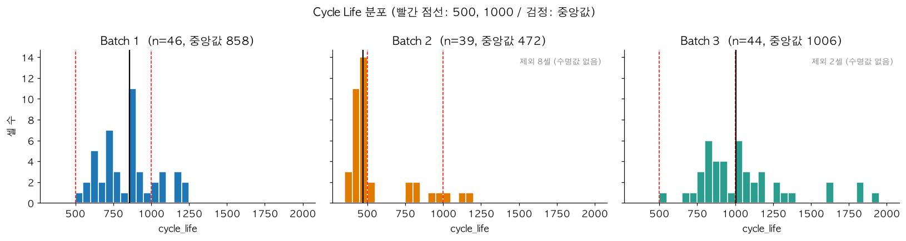
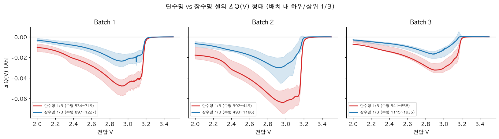
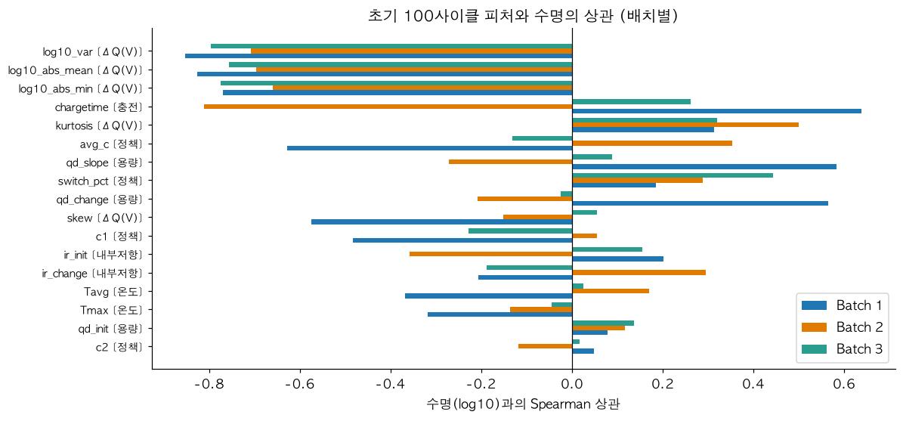

# ESS 배터리 수명 예측

> 초기 100 사이클 데이터만으로 리튬이온 배터리의 총 수명(cycle life)을 예측해, ESS 운영의 교체 시점 계획과 비용 절감에 활용할 수 있는지 검증한다.

**진행 상황**: DAY 1(EDA, 모델 설계) 완료 / DAY 2(모델 개발, 평가) 진행 중

## 프로젝트 개요
- 데이터셋 : MIT-Stanford Battery Dataset (Severson et al., Nature Energy 2019)
- 학습 데이터 : Batch 1 (2017-05-12)
- 평가 데이터 : Batch 2 (2018-02-20)
- 태스크 : **Regression** (Cycle Life 예측, Target = `log10(cycle_life)`, 평가 MAPE)

## 파일 구조
```
├── data/            # README.md 만 포함 (원본/캐시는 git 제외)
├── notebooks/
│   ├── 01_EDA.ipynb
│   ├── 02_feature_engineering.ipynb
│   └── 03_modeling.ipynb
├── src/
│   ├── config.py  load_data.py  preprocess.py
│   └── features.py  split.py  train.py  evaluate.py
├── results/
│   ├── figures/                 # EDA 그래프
│   └── model_performance.csv    # 모델 학습 후 생성
├── pyproject.toml  requirements.txt  uv.lock
└── README.md
```

## 환경 설정
Python 3.11 이상이 필요하다.
```bash
git clone https://github.com/laylalee302/ess-battery-project-skala
cd ess-battery-project-skala
pip install -r requirements.txt     # 또는: uv sync
```
데이터는 [data/README.md](data/README.md) 참고하여 `data/raw/` 에 배치한다.

## EDA
EDA는 Batch 1, 2, 3을 모두 대상으로 했고, 전체 과정과 그래프는 [notebooks/01_EDA.ipynb](notebooks/01_EDA.ipynb)에 있다.



- Cycle Life 분포
  - 분포 형태 및 장단수명 비율 : Batch 1은 534~1227(장수명 21.7%, 단수명 0%), Batch 2는 392~1186(단수명 71.8%), Batch 3은 541~1935(장수명 52.3%)
  - 핵심 발견 : 배치마다 분포가 크게 다르다. Batch 2의 77%가 Batch 1의 최소 수명(534)보다 짧아 학습 데이터에 없던 구간을 예측해야 하고, 550 기준 단수명 셀이 Batch 1에는 1개, Batch 2에는 30개라 분류는 성립하지 않는다.

- 열화 곡선 분석
  - 장수명 vs 단수명 셀의 열화 속도 차이 : 곡선 모양은 같고 시간축만 다르다(수명으로 정규화하면 거의 겹침). 129셀 모두 후반 구간이 앞 구간보다 빠르게 감소한다.
  - Knee point 존재 여부 및 발생 시점 : 수명의 약 75~80% 지점에서 나타나며, 초기 100 사이클 안에 나타난 셀은 0/129이다.
  - 핵심 발견 : knee가 초기 구간에 없어서 용량 변화 자체로는 수명을 맞히기 어렵다.

- ΔQ(V) 곡선 분석
  - Cycle 100 - Cycle 10 차이 곡선 형태 : 약 2.93V에서 가장 깊고 3.2V 부근에서 0으로 수렴한다.
  - 장단수명 셀 간 ΔQ 형태 비교 : 단수명 셀일수록 더 깊게 내려간다(최솟값 단수명 1/3 vs 장수명 1/3: Batch 1 -0.048 vs -0.028, Batch 2 -0.065 vs -0.032, Batch 3 -0.033 vs -0.017 Ah).
  - 핵심 발견 : ΔQ(V)의 log10(분산)이 수명과 Spearman -0.85 / -0.71 / -0.80으로 가장 강하고 일관된 신호다.



- 충전 속도(C-rate)와 수명의 관계
  - 충전 프로토콜별 평균 수명 비교 결과 : 배치 안에서 프로토콜별 평균 수명의 최대/최소 비율이 2.24 / 2.51 / 2.37배이다.
  - 핵심 발견 : 고속 충전일수록 수명이 짧은 경향은 Batch 1에서만 확인된다(평균 C-rate와 수명의 Spearman -0.63). Batch 2, 3은 80%까지 충전하는 시간이 모두 약 10분으로 같다. 같은 프로토콜의 셀은 수명이 거의 같아서 데이터를 프로토콜 단위로 분할해야 한다.

- 상관관계 / 다중공선성
  - 핵심 발견 : 17개 후보 피처 중 ΔQ(V) 요약 통계량이 가장 강하고, 이 통계량들끼리 서로 많이 겹친다(VIF 최대 2606). 그래서 피처를 2개로 줄였다.



- 추가로 확인한 내용
  - Batch 1의 9셀은 수명 시점에도 SOH가 85.6~96.3%여서, EOL에 도달하기 전에 측정이 끝나 cycle_life가 실제보다 짧게 기록되었을 가능성이 높다.
  - cycle_life가 없는 10셀(Batch 2의 8셀, Batch 3의 2셀)은 학습과 평가에서 제외했다.
  - Batch 2의 6셀은 내부저항이 모든 사이클에서 0(미측정)이다.

## Modeling

### 피처 엔지니어링 전략
- 선택 규칙 : (1) Batch 1에서 |ρ| ≥ 0.3, (2) Batch 3에서 같은 부호이고 |ρ| ≥ 0.1, (3) Batch 1에서 VIF < 5, (4) 상수, 결측, 이상값이 있는 피처는 제외. 테스트인 Batch 2의 수명은 피처 선택에 사용하지 않았다.
- Set A (최종 후보) : ΔQ(V)의 log10(분산), 첨도
- Set B (비교용) : Set A에 왜도, 초기 용량, 용량 기울기, Tmax, C2, 전환 지점을 더한 8개
- 제외 : 평균 C-rate, 측정 충전시간, 내부저항 등 (Batch 간 방향이 바뀌거나 Batch 2, 3에서 거의 일정한 값)

### 모델 선택 및 근거
- 후보 모델 : OLS(기준선), Ridge / Elastic Net, Ridge + log10(분산) 2차 항, Huber 회귀, Random Forest / Gradient Boosting(비교군)
- 최종 모델 : 모델 학습 후 결정
- 선택 이유 : 선택 기준은 Batch 1의 CV와 Valid MAPE이다. 선형 계열을 우선한 이유는 Batch 2의 수명이 Batch 1에서 본 범위보다 짧아 학습 범위 밖의 값도 낼 수 있어야 하기 때문이다. 딥러닝 같은 복잡한 모델은 학습 데이터가 46셀(독립 프로토콜 약 23개)로 적어서 쓰지 않았다.
- 데이터 분할 : Train은 Batch 1(GroupKFold, 그룹 = 충전 프로토콜), Valid는 Batch 1 Hold-out(프로토콜 단위), Test는 Batch 2(최종 평가 1회)

## 성능 결과
모델 학습 후 작성

| 구분 | MAPE (%) | 비고 |
|---|---|---|
| Train (Batch 1 CV) | | |
| Valid (Batch 1 Hold-out) | | |
| Test (Batch 2) | | |
| Gap (Train-Valid) | | (+) : 과적합 의심 |
| Gap (Valid-Test) | | (+) : 배치간 일반화 저하 의심 |
| Gap (Target-Test) | | Target : 원논문 9.1% |

Gap 해석:

## 오류 분석
모델 학습 후 작성
- 모델이 가장 크게 틀린 셀의 공통점 :
- 원인 가설 및 개선 방향 :

## ESS 도메인 해석
모델 학습 후 작성
- 이 모델을 실제 BESS에 적용한다면 어떤 의사결정에 활용 가능한가?
- 어떤 한계가 있으며, 실 배포를 위해 추가로 필요한 것은 무엇인가?

## 참고문헌
- Severson et al. (2019). Data-driven prediction of battery cycle life before capacity degradation. *Nature Energy*, 4, 383-391.

## 팀 구성
- (이름) : 
- (이름) : 
